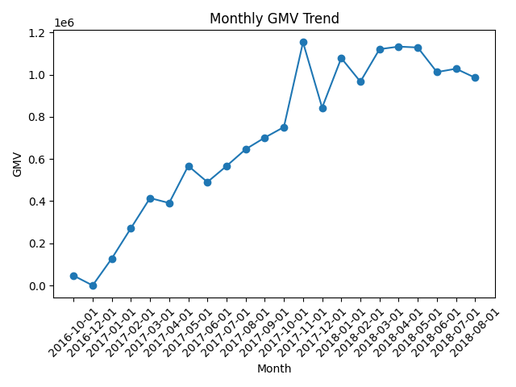
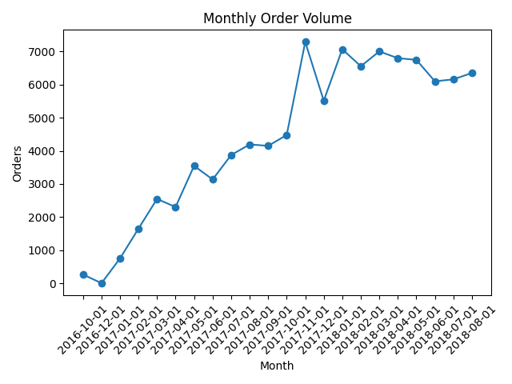
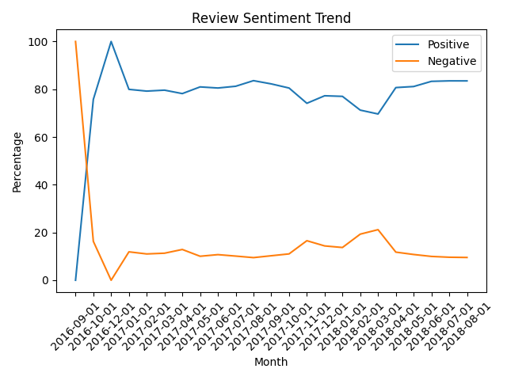
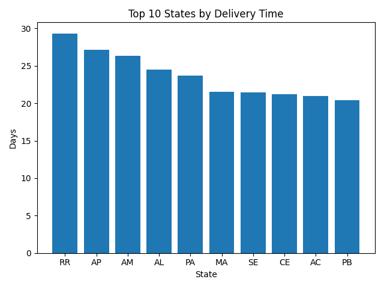
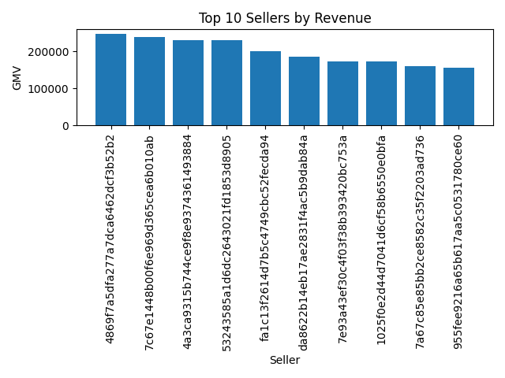

# 📊 Customer KPI Engine  
### 🚀 SQL + Python Data Pipeline for E-Commerce Analytics


---

## 🧠 Project Overview

Most data projects stop at dashboards.

This project goes deeper — simulating how real data teams build **reliable data products**.

Using a 100k+ row e-commerce dataset, I built an **end-to-end analytics pipeline**:

Raw Data → SQL → Data Quality Checks → KPI Views → Python Automation → Excel Reports → Charts


---

## 🎯 Objective

To replicate how companies ensure:

- ✅ Data accuracy before analysis  
- ✅ Reliable KPI generation  
- ✅ Automated reporting workflows  
- ✅ Business-ready insights  

---

## 🏗️ Architecture
CSV Files
↓
MySQL Database
↓
Data Quality Checks (SQL + Python)
↓
Analytical Views
↓
KPI Views (SQL)
↓
Python Automation
↓
Excel Report + Visual Charts


---

## 🛠️ Tech Stack

- 🐍 Python (Pandas, SQLAlchemy)
- 🗄️ MySQL
- 📊 Matplotlib
- 📄 Excel (OpenPyXL)
- 🧠 SQL (Joins, CTEs, Window Functions)

---

## ⚙️ Key Features

### 🔹 Data Engineering
- Loaded and structured **100k+ rows across 8 relational tables**
- Designed schema for scalable analytics

---

### 🔹 Data Quality Layer (🚨 Most Important)

Before analysis, built automated checks to detect:

- Duplicate order IDs  
- Orders without payments  
- Missing customer links  
- Negative transaction values  
- Invalid delivery timestamps  

📌 **Example Insight:**  
Found 1 order without a payment record → excluded from revenue KPIs

---

### 🔹 KPI Development

Built SQL views for:

- 📈 Monthly GMV (revenue trend)  
- 🛒 Order volume  
- 💰 Average Order Value (AOV)  
- 🔁 Repeat customer rate  
- 🚚 Delivery performance by state  
- ⭐ Review sentiment trends  
- 🏪 Revenue concentration (top sellers)  

---

### 🔹 Automation

Python pipeline to:

- Extract KPI views  
- Generate CSV outputs  
- Create multi-sheet Excel reports  
- Produce charts for visualization  

---

## 📊 Visual Outputs

### 📈 Monthly GMV Trend


### 🛒 Order Volume Trend


### ⭐ Review Sentiment Trend


### 🚚 Delivery Performance


### 🏪 Top Sellers Revenue


---

## 📄 Final Deliverables

- 📊 Excel Report → `outputs/reports/customer_kpi_engine_report.xlsx`
- 📉 Charts → `outputs/charts/`
- 📋 Data Quality Report → `outputs/reports/data_quality_report.csv`

---

## 🧠 Key Business Insights

- 📌 A small percentage of sellers contribute a large share of total revenue → **platform dependency risk**
- 📌 Delivery performance varies significantly across states → **operational inefficiencies**
- 📌 Customer sentiment fluctuates over time → **linked to delivery experience**
- 📌 Repeat customer rate highlights **customer retention patterns**

---

## 💬 Analyst Note

Before generating KPIs, I implemented a data quality layer to ensure data integrity.

For example, orders without payment records were excluded from revenue calculations to avoid inaccuracies.

The analysis shows that while overall GMV is stable, operational inefficiencies in delivery impact customer satisfaction.

Additionally, revenue concentration among top sellers suggests potential platform risk.

---

## 📚 What I Learned

- Importance of validating data before analysis  
- Handling relational joins and missing links  
- Building reusable SQL views  
- Automating reporting pipelines  
- Translating data into business insights  

---

## 🚀 How to Run This Project

```bash
pip install -r requirements.txt

python src/load_to_mysql.py
python src/run_quality_checks.py
python src/generate_kpi_excel_report.py
python src/create_charts.py

---

##📌 Why This Project Matters

This project demonstrates:

✔ SQL + Python integration
✔ Data quality-first mindset
✔ Real-world pipeline design
✔ Business-focused analytics
✔ Automated reporting


---

# 🚀 Step 4: Save file

Press:

```text
Ctrl + S